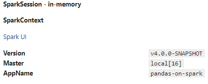

# Overview
This project provides daily built Docker images designed for data science workflows. These images include Debian Testing, JupyterLab, the master branch of Apache Spark, and the latest supported version of Pandas. They are optimized for both Docker and Kubernetes (k8s) environments, catering to a wide range of data processing and analysis needs.

## Features

- **Debian Testing**: Ensures a stable and up-to-date operating system environment.
- **JupyterLab**: Offers an interactive development environment for data science projects.
- **Apache Spark (master branch)**: Provides the latest features and improvements from the Apache Spark project. Only python and K8S package. 
- **Pandas (latest Spark supported version)**: Includes the most recent enhancements and fixes from the Pandas library.

## How to Use

### Running with Docker

To get started with Docker, use the following command to pull and run the image:

```shell
docker-compose up -d
```

This command deploys the Docker containers as defined in your docker-compose.yaml file.

Example Python Code
You can interact with the Apache Spark and Pandas frameworks directly from Python. Here's a brief setup for initializing a SparkSession and configuring it for your needs:

This configuration will start Spark utilizing all available memory and CPU cores on a single machine.

```python
import multiprocessing
import os
import numpy as np
import pandas as pd
import pyarrow as pa
from pyspark import pandas as ps
from pyspark.sql import SparkSession
import pyspark.sql.functions as SF

# Calculate the number of cores and memory usage for Spark configuration
number_cores = multiprocessing.cpu_count()
mem_bytes = os.sysconf("SC_PAGE_SIZE") * os.sysconf("SC_PHYS_PAGES")  # Total memory in bytes
memory_gb = int(mem_bytes / (1024.0 ** 3))  # Convert bytes to gigabytes

# Initialize a SparkSession with custom configurations
spark = (SparkSession.builder
         .appName("pandas-on-spark")
         .master(f"local[{number_cores}]")  # Use all available cores
         # Set driver memory to the calculated memory size
         .config("spark.driver.memory", f"{memory_gb}g")
         # Enable adaptive query execution, which can optimize query plans automatically
         .config("spark.sql.adaptive.enabled", "True")
         # Use KryoSerializer for better performance in shuffle and cache operations
         .config("spark.serializer", "org.apache.spark.serializer.KryoSerializer")
         # Limit the number of rows shown in eager evaluation output
         .config("spark.sql.repl.eagerEval.maxNumRows", "50")
         .getOrCreate())

# Optionally set log level to ERROR to reduce the amount of logs shown
spark.sparkContext.setLogLevel("ERROR")
```

`spark`




## Kubernetes Configuration

This setup is tailored for data science workloads that require scalability and distributed processing capabilities.

```python

import numpy as np
import pandas as pd
import pyarrow as pa
from pyspark import pandas as ps
from pyspark.sql import SparkSession
import pyspark.sql.functions as SF


spark = SparkSession.builder \
  .master("k8s://https://kubernetes.default.svc.cluster.local:443") \
  .config("spark.kubernetes.container.image", "bjornjorgensen/spark-worker") \
  .config("spark.kubernetes.container.image.pullPolicy", "Always") \
  .config("spark.kubernetes.authenticate.caCertFile", "/var/run/secrets/kubernetes.io/serviceaccount/ca.crt") \
  .config("spark.kubernetes.authenticate.oauthTokenFile", "/var/run/secrets/kubernetes.io/serviceaccount/token") \
  .config("spark.kubernetes.authenticate.driver.serviceAccountName", "my-pyspark-notebook") \
  .config("spark.executor.instances", "4") \
  .config("spark.driver.host", "my-pyspark-notebook-spark-driver.default.svc.cluster.local") \
  .config("spark.driver.port", "29413") \
  .config("spark.sql.repl.eagerEval.enabled", "True") \
  .config("spark.driver.memory", "50g") \
  .config("spark.executor.memory", "13g") \
  .config("spark.driver.cores", "13") \
  .config("spark.executor.cores", "6") \
  .config("spark.kubernetes.driver.volumes.persistentVolumeClaim.300gb.options.claimName", "300gb") \
  .config("spark.kubernetes.driver.volumes.persistentVolumeClaim.300gb.mount.path", "/opt/spark/work-dir") \
  .config("spark.kubernetes.driver.volumes.persistentVolumeClaim.300gb.mount.readOnly", "False") \
  .config("spark.kubernetes.executor.volumes.persistentVolumeClaim.300gb.options.claimName", "300gb") \
  .config("spark.kubernetes.executor.volumes.persistentVolumeClaim.300gb.mount.path", "/opt/spark/work-dir") \
  .config("spark.kubernetes.executor.volumes.persistentVolumeClaim.300gb.mount.readOnly", "False") \
  .config("fs.s3a.access.key", "minioadmin") \
  .config("fs.s3a.secret.key", "Password") \
  .config("fs.s3a.endpoint", "http://LOCALHOST:9000") \
  .config("spark.hadoop.fs.s3a.impl", "org.apache.hadoop.fs.s3a.S3AFileSystem") \
  .config("spark.hadoop.fs.s3a.path.style.access", "true") \
  .config("spark.kubernetes.node.selector.node-role", "spark-driver") \
  .config("spark.kubernetes.executor.node.selector.node-role", "spark-worker") \
  .config("spark.sql.adaptive.enabled", "True") \
  .config("spark.serializer", "org.apache.spark.serializer.KryoSerializer") \
  .config("spark.sql.repl.eagerEval.maxNumRows", "50") \
  .appName("pandas-on-spark") \
  .getOrCreate()
```
